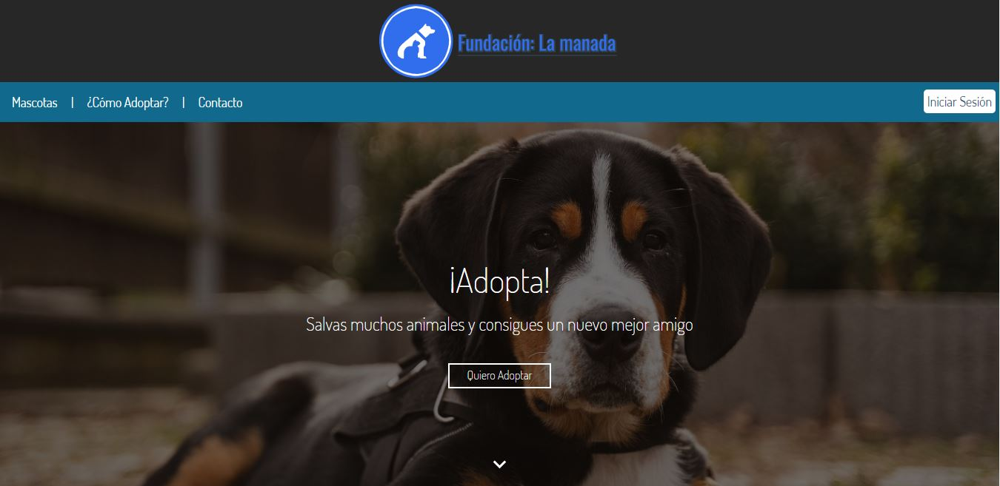

![Contributors][contributors-shield] ![License][license-shield]

<!-- FUNDACIÓN: LA MANADA
=============== -->

<!-- Header -->

	
	<h3 align="center"> Fundación: La manada  </h3>
	
 "Respetar a los animales es una obligación, amarlos es un privilegio" 

<!-- About -->
## Nuestro proyecto

Nuestro equipo de desarrolladores está trabajando en la creación de una página web que permita facilitar la adopción de animales domésticos. Nos apoyamos por medio de una fundación; como programadores diseñamos un sitio que sirva de ayuda a aquellas personas interesadas en apoyar la causa, facilitándole la interacción con el sitio y la fundación. Nuestro propósito es establecer una comunicación entre el usuario y los miembros de la fundación para realizar los trámites requeridos.

## Nuestra fundación
Fundación: La manada; es una organización que tiene por objetivo conseguir un nuevo hogar a los animales que lo necesiten mientras son atendidos por nuestros colaboradores.

<!-- Licencia -->
Distributed under the GPL License. See `LICENSE` for more information.

<!-- Declaraciones -->
[contributors-shield]: https://img.shields.io/github/contributors/Javithor360/manada.svg?style=for-the-badge
[license-shield]: https://img.shields.io/github/license/Javithor360/manada.svg?style=for-the-badge