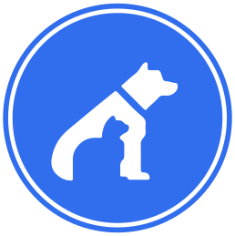

![Contributors][contributors-shield] ![License][license-shield]

<!-- Header -->

	
	<h3 align="center"> Fundación: La manada  </h3>
	
 "Respetar a los animales es una obligación, amarlos es un privilegio" 

<!-- About -->
## Nuestro proyecto

Nuestro equipo de desarrolladores está trabajando en la creación de una página web que permita facilitar la adopción de animales domésticos. Nos apoyamos por medio de una fundación; como programadores diseñamos un sitio que sirva de ayuda a aquellas personas interesadas en apoyar la causa, facilitándole la interacción con el sitio y la fundación. Nuestro propósito es establecer una comunicación entre el usuario y los miembros de la fundación para realizar los trámites requeridos.

## Nuestra fundación
Fundación: La manada; es una organización que tiene por objetivo conseguir un nuevo hogar a los animales que lo necesiten mientras son atendidos por nuestros colaboradores.

* **Misión**
> Somos una fundación salvadoreña especializada en el cuido de animales domésticos y nos encargarmos de brindar la mejorar atención a aquellos amigos de cuatro patas que han sido puestos en adopción, asegurando su cuido mientras encuentran un nuevo hogar.

* **Visión**
> Ser una fundación bastante reconocida por nuestra labor para expandirnos a otros países del contiente centroaméricano y así ejercer nuestra labor de cuido en el extranjero ampliando nuestro rumbo al rescate de animales en las calles para brindarles el buen cuido que merecen.

<!-- Tools -->
## Herramientas utilizadas para el desarrollo
Para la elaboración del proyecto, utilizamos un sinfín de softwares y herramientas de apoyo para moldear el desarrollo Fullstack en el sitio web. Entre todas las herramientas, cabe destacar:

|   | Herramientas       |
|---|--------------------|
| <svg xmlns="http://www.w3.org/2000/svg" width="24" height="24" viewBox="0 0 24 24" style="fill: #11698e;transform: ;msFilter:;"><path d="m21.29 4.1-4.12-2a1.36 1.36 0 0 0-.48-.1h-.08a1.18 1.18 0 0 0-.72.24l-.14.12-7.88 7.19L4.44 7a.83.83 0 0 0-.54-.17.88.88 0 0 0-.53.17l-1.1 1a.8.8 0 0 0-.27.61.84.84 0 0 0 .27.62l3 2.71-3 2.72a.84.84 0 0 0 0 1.23l1.1 1a.89.89 0 0 0 .6.22.93.93 0 0 0 .47-.17l3.43-2.61 7.88 7.19a1.2 1.2 0 0 0 .76.36h.17a1 1 0 0 0 .49-.12l4.12-2a1.25 1.25 0 0 0 .71-1.1V5.23a1.26 1.26 0 0 0-.71-1.13zM17 16.47l-6-4.53 6-4.53z"></path></svg> | Visual Studio Code |
| <svg xmlns="http://www.w3.org/2000/svg" width="24" height="24" viewBox="0 0 24 24" style="fill: #11698e;transform: ;msFilter:;"><path d="M2.15 16.78h1.57a.14.14 0 0 0 .14-.12l.35-1.82h1.22a4.88 4.88 0 0 0 1.51-.2A2.79 2.79 0 0 0 8 14a3.18 3.18 0 0 0 .67-.85 3.43 3.43 0 0 0 .36-1 2.43 2.43 0 0 0-.41-2.16 2.64 2.64 0 0 0-2.09-.78h-3a.16.16 0 0 0-.15.13L2 16.6a.19.19 0 0 0 0 .13.17.17 0 0 0 .15.05zM5 10.62h1a1.45 1.45 0 0 1 1.08.29c.17.18.2.52.11 1a1.81 1.81 0 0 1-.57 1.12 2.17 2.17 0 0 1-1.33.33h-.8zm9.8-.95a2.7 2.7 0 0 0-1.88-.51h-1.19l.33-1.76a.15.15 0 0 0 0-.13.16.16 0 0 0-.11 0h-1.57a.14.14 0 0 0-.14.12l-1.38 7.27a.13.13 0 0 0 0 .12.13.13 0 0 0 .11.06h1.54a.14.14 0 0 0 .14-.13l.77-4.07h1.11c.45 0 .61.1.66.16a.81.81 0 0 1 0 .62l-.61 3.24a.13.13 0 0 0 0 .12.14.14 0 0 0 .11.06h1.56a.16.16 0 0 0 .15-.13l.64-3.4a1.7 1.7 0 0 0-.24-1.64zm4.52-.51h-3.13a.14.14 0 0 0-.15.13l-1.46 7.31a.16.16 0 0 0 0 .13.14.14 0 0 0 .11.05h1.63a.14.14 0 0 0 .15-.12l.37-1.82h1.27a5.28 5.28 0 0 0 1.56-.2 3 3 0 0 0 1.18-.64 3.31 3.31 0 0 0 .7-.85 3.45 3.45 0 0 0 .37-1 2.38 2.38 0 0 0-.42-2.16 2.81 2.81 0 0 0-2.18-.83zm.62 2.77a1.83 1.83 0 0 1-.6 1.12 2.28 2.28 0 0 1-1.37.33h-.8l.54-2.76h1a1.6 1.6 0 0 1 1.13.29c.16.18.16.52.1 1.02z"></path></svg> | PHP              	 |
| <svg version="1.1" id="Capa_1" xmlns="http://www.w3.org/2000/svg" xmlns:xlink="http://www.w3.org/1999/xlink" x="0px" y="0px" viewBox="0 0 54 54" style="fill: #11698e;enable-background:new 0 0 54 54;" xml:space="preserve"><path d="M41.824,0H12.176C5.462,0,0,5.462,0,12.176v29.648C0,48.538,5.462,54,12.176,54h29.648C48.538,54,54,48.538,54,41.824V12.176C54,5.462,48.538,0,41.824,0z M52,41.824C52,47.435,47.435,52,41.824,52H12.176C6.565,52,2,47.435,2,41.824V12.176C2,6.565,6.565,2,12.176,2h29.648C47.435,2,52,6.565,52,12.176V41.824z"/><path d="M19.92,12h-9.64v28h2.88v-9.2h7.04c1.36,0,2.533-0.246,3.52-0.74c0.986-0.493,1.72-1.065,2.2-1.72c0.48-0.653,0.86-1.493,1.14-2.52c0.28-1.026,0.446-1.88,0.5-2.561c0.053-0.68,0.08-1.486,0.08-2.42c0-2.64-0.634-4.773-1.9-6.399C24.473,12.813,22.533,12,19.92,12z M24.74,22.6c-0.014,0.4-0.107,1-0.28,1.801c-0.173,0.8-0.414,1.413-0.72,1.84c-0.307,0.427-0.794,0.826-1.46,1.2C21.613,27.813,20.8,28,19.84,28h-6.68V14.8h6.52c3.386,0,5.08,2.027,5.08,6.08C24.76,21.627,24.753,22.2,24.74,22.6z"/><path d="M41.22,29.44c-1.054-0.427-2.114-0.813-3.18-1.16c-1.067-0.347-2.027-0.773-2.88-1.28c-0.854-0.506-1.28-1.2-1.28-2.08c0-0.8,0.34-1.46,1.02-1.979c0.68-0.521,1.713-0.78,3.1-0.78c1.386,0,2.506,0.334,3.36,1l0.92-2.521L41.8,20.36c-0.32-0.187-0.854-0.38-1.6-0.58c-0.747-0.2-1.547-0.3-2.4-0.3c-2.427,0-4.18,0.579-5.26,1.739s-1.62,2.414-1.62,3.761s0.493,2.486,1.48,3.42c0.8,0.8,1.727,1.387,2.78,1.76c1.053,0.374,2.1,0.727,3.14,1.06c1.04,0.334,1.92,0.787,2.64,1.36c0.72,0.573,1.08,1.347,1.08,2.32s-0.42,1.72-1.26,2.239c-0.84,0.521-1.834,0.78-2.98,0.78s-2.16-0.273-3.04-0.82c-0.88-0.546-1.374-1.313-1.48-2.3l-2.8,0.12c0.053,1.6,0.733,2.947,2.04,4.04c1.306,1.093,3.113,1.64,5.42,1.64c2.306,0,4.06-0.554,5.26-1.659c1.2-1.106,1.8-2.406,1.8-3.9c0-1.493-0.367-2.693-1.1-3.6S42.273,29.867,41.22,29.44z"/></svg> | Adobe Photoshop    |
| <svg version="1.1" id="Capa_1" xmlns="http://www.w3.org/2000/svg" xmlns:xlink="http://www.w3.org/1999/xlink" x="0px" y="0px" viewBox="0 0 54 54" style="fill: #11698e;enable-background:new 0 0 54 54;" xml:space="preserve"><path d="M41.824,0H12.176C5.462,0,0,5.462,0,12.176v29.648C0,48.538,5.462,54,12.176,54h29.648C48.538,54,54,48.538,54,41.824V12.176C54,5.462,48.538,0,41.824,0z M52,41.824C52,47.435,47.435,52,41.824,52H12.176C6.565,52,2,47.435,2,41.824V12.176C2,6.565,6.565,2,12.176,2h29.648C47.435,2,52,6.565,52,12.176V41.824z"/><path d="M19.84,12L11.6,40h3.12l2.64-9.04h8.32L28.44,40h3.24l-8.52-28H19.84z M18.12,28l3.36-11.36L24.96,28H18.12z"/><path d="M36.859,11.6c-0.44,0-0.827,0.167-1.16,0.5c-0.334,0.334-0.5,0.714-0.5,1.141s0.166,0.807,0.5,1.14c0.333,0.334,0.72,0.5,1.16,0.5c0.44,0,0.82-0.16,1.14-0.479c0.32-0.32,0.48-0.707,0.48-1.16S38.32,12.4,38,12.08C37.68,11.76,37.3,11.6,36.859,11.6z"/><rect x="35.359" y="19.96" width="2.88" height="20.04"/></svg> | Adobe Illustrator  |
| <svg xmlns="http://www.w3.org/2000/svg" width="24" height="24" viewBox="0 0 24 24" style="fill: #11698e;transform: ;msFilter:;"><path d="M20.283 10.356h-8.327v3.451h4.792c-.446 2.193-2.313 3.453-4.792 3.453a5.27 5.27 0 0 1-5.279-5.28 5.27 5.27 0 0 1 5.279-5.279c1.259 0 2.397.447 3.29 1.178l2.6-2.599c-1.584-1.381-3.615-2.233-5.89-2.233a8.908 8.908 0 0 0-8.934 8.934 8.907 8.907 0 0 0 8.934 8.934c4.467 0 8.529-3.249 8.529-8.934 0-.528-.081-1.097-.202-1.625z"></path></svg> | Google Fonts       |

<!-- How to use -->
## Cómo instalar
Por el momento, el sitio únicamente funciona de manera local y requiere seguir una serie de pasos para hacerla funcional:

1. Descargar el repositorio
2. Descargar XAMPP
3. Mover el repositorio a la ruta `C:/xampp/htdocs/`
4. En la carpeta `manada/examples`, descomprime el archivo rar
5. Copia el archivo `php.ini` en la ruta `C:/xampp/php/` y reemplazalo por el ya existente
6. Copia el archivo `sendmail.ini` en la ruta `C:/xampp/sendmail/` y también reemplazalo por el ya existente
7. Inicia el módulo `Apache` y `MySQL` en el panel de XAMPP
8. Abre el navegador en la url `localhost/phpmyadmin/`
9. Abre la pestaña `SQL` y digita el comando `CREATE DATABASE login` para luego presionar el botón **`Continuar`**
10. Dirígete a la base de datos `login` creada anteriormente
11. Abre la pestaña `Importar` y presiona el botón `Seleccionar archivo`
12. Nuevamente, ve a la ruta `C:/xampp/htdocs/manada/examples` y selecciona el archivo `login.sql` para finalmente presionar el botón `Continuar`
13. Finalmente, para abrir la página escribe la url `http://localhost/manada/index.php` en el navegador

## Características del sitio web
Nuestro sitio web cuenta con unas características peculiares e interesantes para el usuario, entre ellas se pueden destacar las siguientes.

- **Diseño responsive**

Es decir, un diseño dinámico que se puede adaptar a múltiples tipos de pantalla o simplemente, tamaños de ventana

- **Sistema bilingüe**

El usuario tendrá la opción de cambiar el idioma del sitio web entre `Español` e `Inglés`

- **Envío de correos**

Una característica extra que sirve para informar al usuario el estado de sus solicitudes

- **Blog con guías informativas**

Un apartado extra en el sitio web que permite al usuario informarse acerca de temas relacionados a las mascotas

- **Sistema de cuentas**

Para poder manejar y utilizar de manera correcta la página, el usuario podrá crear una cuenta e iniciar sesión en ella para llevar a cabo los procesos que lo requieran

- **Páginas válidadas**

Se cuenta con una página para detectar páginas no existentes y página bloquea en caso de autorización especial.

- **Sistema de contacto**

En caso de dudas, reportes o quejas; contamos con un sistema de contacto por medio de correo electrónico para mantenernos en contacto con el usuario.

- **¡Entre otros!**

## Advertencia
Este proyecto sigue en desarrollo y está sujeto a muchísimos cambios. Hecho con propósitos educativos.

<!-- Licencia -->
Distributed under the GPL License. See `LICENSE` for more information.
---

<!-- Declaraciones -->
[contributors-shield]: https://img.shields.io/github/contributors/Javithor360/manada.svg?style=for-the-badge
[license-shield]: https://img.shields.io/github/license/Javithor360/manada.svg?style=for-the-badge